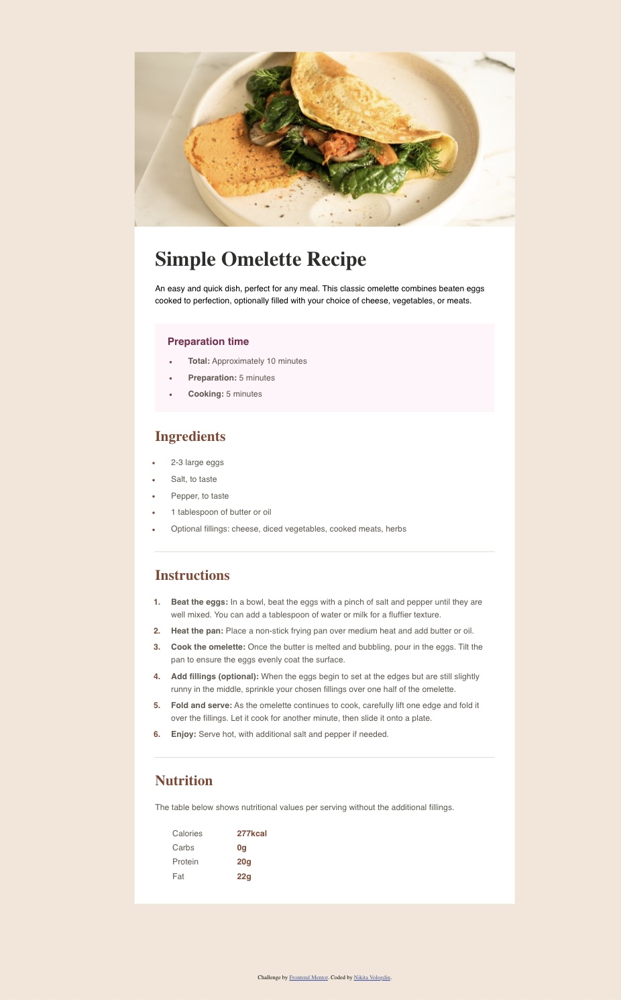

# Frontend Mentor - Recipe page solution

This is a solution to the [Recipe page challenge on Frontend Mentor](https://www.frontendmentor.io/challenges/recipe-page-KiTsR8QQKm). Frontend Mentor challenges help you improve your coding skills by building realistic projects.

## Table of contents

- [Overview](#overview)
  - [The challenge](#the-challenge)
  - [Screenshot](#screenshot)
  - [Links](#links)
  - [Built with](#built-with)
  - [What I learned](#what-i-learned)
  - [Useful resources](#useful-resources)
- [Author](#author)

## Overview

This project involved creating a recipe page with responsive design, custom styling, and pixel-perfect alignment. Key features include tables, lists, and custom fonts. I overcame challenges related to layout and responsiveness. Through this project, I gained experience in HTML, CSS, and responsive design techniques.

### Screenshot

### Links

- Solution URL: [Github](https://github.com/NikitaVologdin/recipe-page)
- Live Site URL: [Vercel](https://recipe-page-kzrfitq8s-nikitavologdins-projects.vercel.app/)

### Built with

- Semantic HTML5 markup
- CSS custom properties
- Flexbox
- CSS Grid
- Mobile-first workflow

### What I learned

element+element selector
::marker pseudo-element

### Useful resources

- [element+element](https://developer.mozilla.org/en-US/docs/Web/CSS/Next-sibling_combinator) - This helped me find way make margins for list items without nth child. I really liked this pattern and will use it going forward.
- [::marker](https://developer.mozilla.org/en-US/docs/Web/CSS/::marker) - This is an amazing article which helped me finally understand Ul, Ol styling. I'd recommend it to anyone still learning this concept.

## Author

- Website - [Nikita Vologdins](https://vologdin.eu/portfolio)
- Frontend Mentor - [@NikitaVologdin](https://www.frontendmentor.io/profile/NikitaVologdin)
